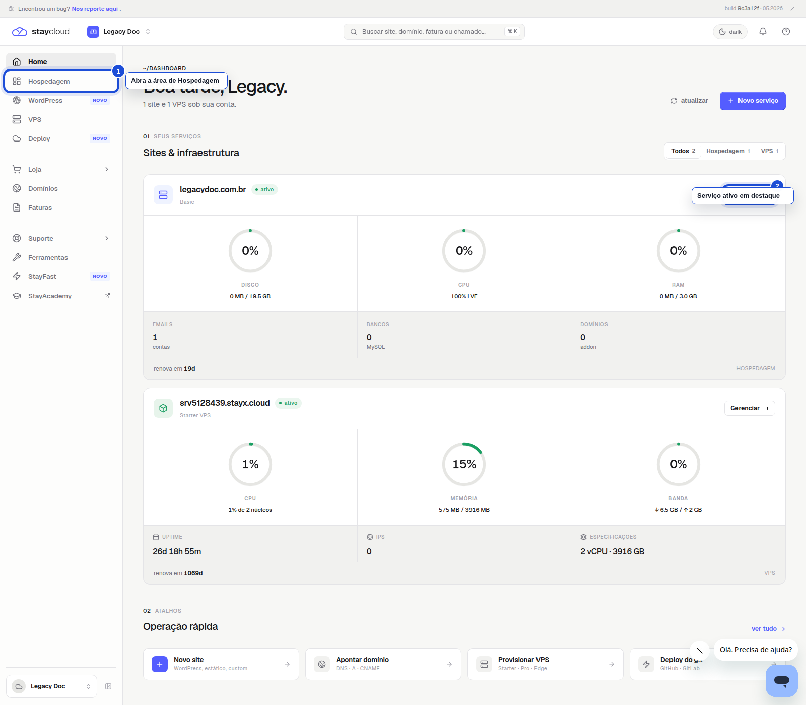
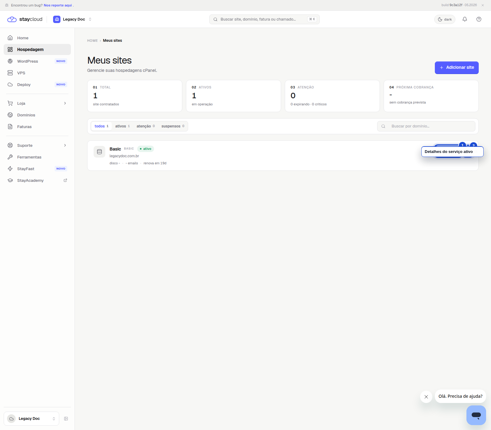
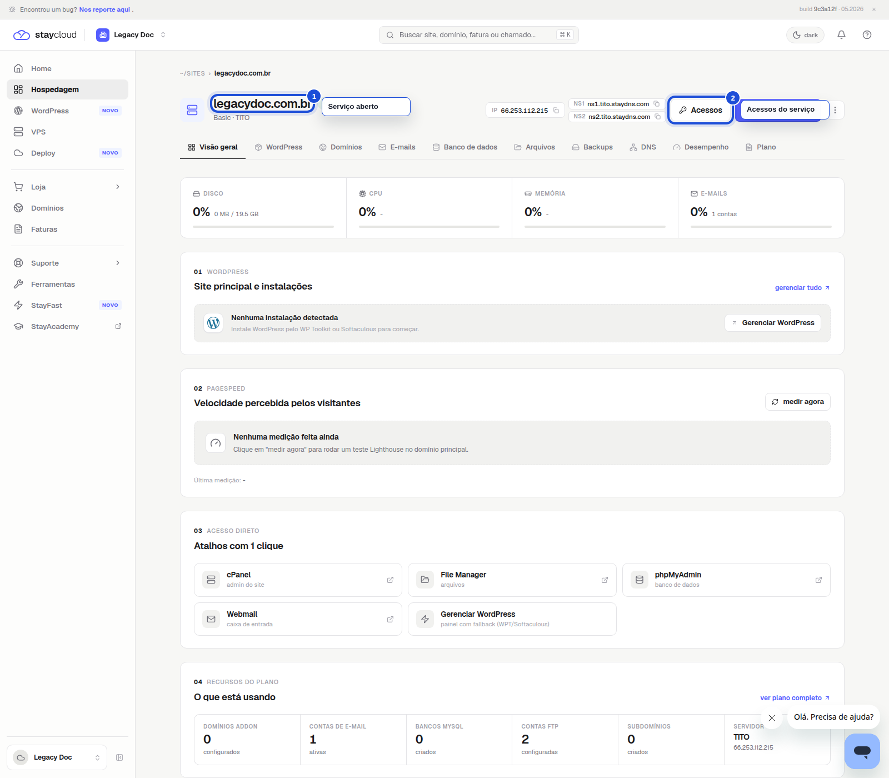

# Como encontrar seus serviços ativos no Painel Novo da StayCloud

Se você quer localizar sua hospedagem, seu domínio ou outro produto ativo da sua conta, este tutorial mostra onde olhar no Painel Novo da StayCloud e como abrir o serviço correto.

## Objetivo

Ensinar você a entrar no Painel Novo e identificar os serviços ativos da sua conta com segurança.

## Quando usar este tutorial

Use este passo a passo quando quiser:

- ver quais serviços estão ativos na sua conta
- encontrar a hospedagem correta antes de seguir para outra ação
- conferir o nome do domínio vinculado ao serviço
- abrir os detalhes de um serviço ativo no Painel Novo

## Antes de começar

- Tenha acesso ao seu Painel Novo da StayCloud
- Se você tiver mais de um serviço, confira o nome do domínio antes de continuar
- Use este guia apenas para localizar serviços ativos. Não há nenhuma etapa no cPanel

## Passo a passo

### 1. Acesse o Painel Novo

Entre no Painel Novo da StayCloud e confira a tela inicial. É nela que você começa a navegação da sua conta.

*Acesse a área de Hospedagem no menu lateral e comece por ali.*

### 2. Abra a área de hospedagem

No menu lateral, clique em **Hospedagem**. Essa área mostra os serviços contratados da sua conta.

*Na página Meus sites, veja o resumo dos serviços e localize a hospedagem ativa.*

### 3. Localize o serviço ativo correto

Procure o cartão do serviço com status **ativo**. Confirme o nome do domínio e, se quiser abrir os detalhes, clique no cartão do serviço para continuar.

*Aqui você confirma que abriu o serviço certo antes de seguir para qualquer ajuste.*

## Erros comuns

- Abrir o serviço errado quando há mais de um produto ativo
- Confundir a hospedagem com a VPS ou outro serviço
- Não conferir o nome do domínio antes de seguir
- Procurar o caminho em outra área do painel sem olhar a seção de Hospedagem

## Quando abrir ticket

Abra um ticket se:

- você não encontrar seu serviço ativo na conta
- o status do serviço aparecer diferente do esperado
- o nome do domínio não bater com o que você procura
- a área de Hospedagem não carregar corretamente

## Conclusão

Agora você sabe como localizar seus serviços ativos no Painel Novo da StayCloud e abrir o serviço correto com mais segurança.

## SEO

- **Palavra-chave:** serviços ativos painel novo staycloud
- **Título SEO:** Como encontrar seus serviços ativos no Painel Novo da StayCloud
- **Slug:** como-encontrar-servicos-ativos-painel-novo-staycloud
- **Meta description:** Veja como localizar seus serviços ativos no Painel Novo da StayCloud e acessar a hospedagem, domínio ou produto correto.

### Checklist SEO Rank Math

- Palavra-chave no título
- Palavra-chave na introdução
- Palavra-chave no slug
- Meta description definida
- Texto claro e direto
- Estrutura curta e objetiva
- Uma ação principal por etapa

### Checklist UI/UX

- O texto fala direto com você
- Cada passo mostra onde clicar
- A tela inicial orienta o começo
- A área de serviços está fácil de reconhecer
- O serviço ativo fica claro no print
- O fluxo não depende de cPanel

### Checklist visual/prints

- Print 01 com área principal destacada
- Print 02 com a área de serviços destacada
- Print 03 com o serviço correto em destaque
- Marcações visuais claras
- Sem dados sensíveis
- Legenda útil em cada imagem
- ALT text definido em cada imagem

### Checklist final antes do WordPress

- Texto em tom de cliente final
- Passos curtos e diretos
- Prints reais inseridos
- HTML preview conferido
- HTML WordPress limpo
- Nenhum uso de cPanel
- Nenhum dado sensível exposto

**Status:** rascunho local
