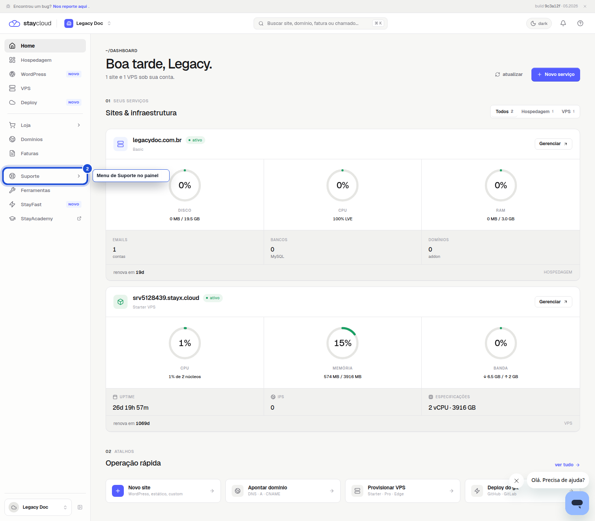
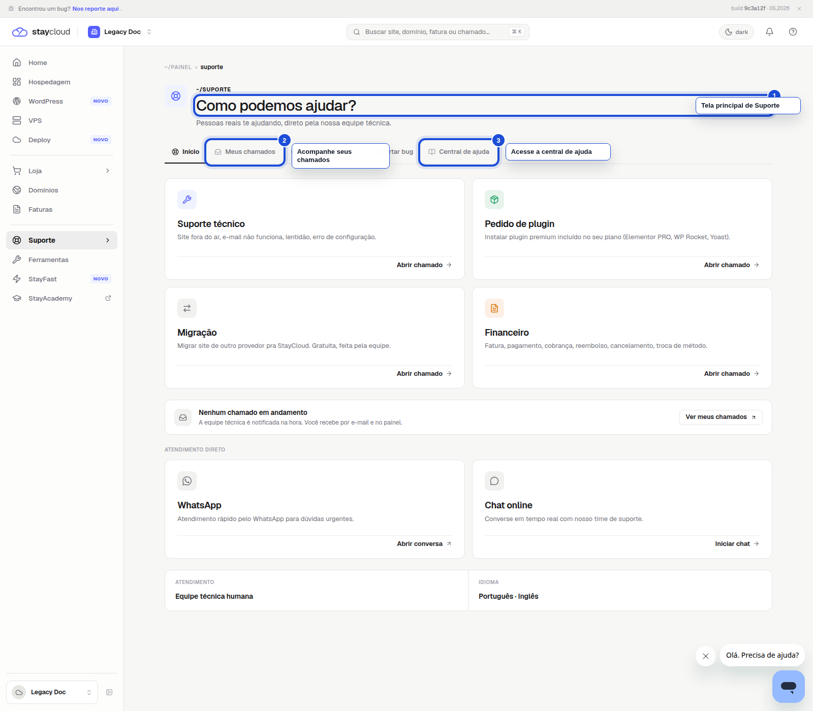
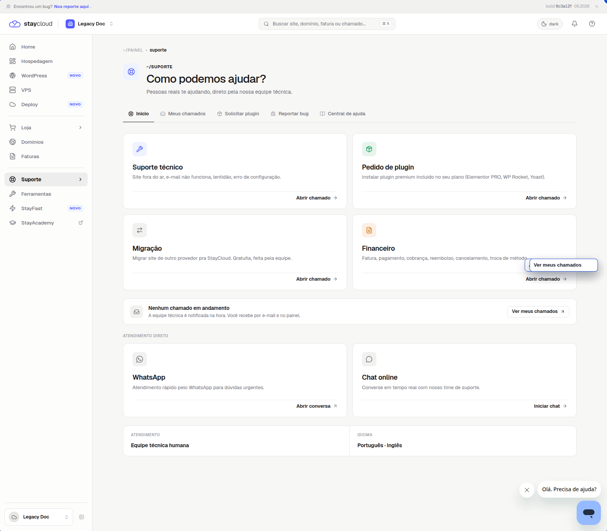
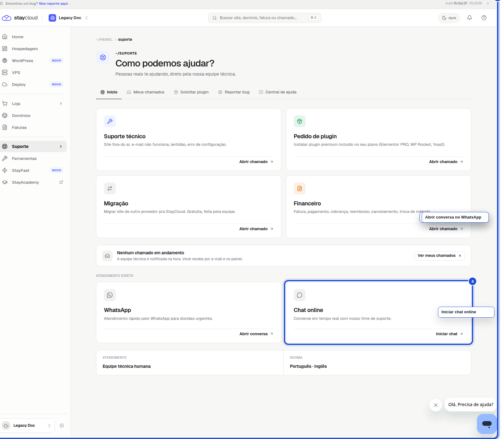

# Como localizar a area de Suporte no Painel Novo da StayCloud

Se você precisar falar com a StayCloud, abrir um chamado ou consultar a ajuda da sua conta, a area de Suporte e o caminho certo.

Neste tutorial, você vai ver exatamente onde clicar no Painel Novo para chegar ate a tela de suporte e acessar os canais disponiveis.

## Quando usar este tutorial

Use este passo a passo quando quiser:

- encontrar a area de Suporte no Painel Novo;
- abrir um chamado;
- ver seus chamados em andamento;
- acessar a central de ajuda;
- falar com a equipe por WhatsApp ou chat.

## Antes de comecar

Antes de seguir, entre na sua conta da StayCloud e confirme que voce esta no Painel Novo.

Se a tela inicial estiver carregando, espere alguns segundos antes de clicar em outra opcao.

## Passo a passo

### 1. Abra o Painel Novo

Depois de fazer login, voce ve a tela inicial com o menu lateral e a lista de servicos da sua conta.

*Nessa tela, clique em Suporte no menu lateral.*

### 2. Entre na area de Suporte

Ao abrir Suporte, confira se a tela mostra o titulo **Como podemos ajudar?**.

*Essa e a tela correta para abrir chamados, consultar ajuda e acompanhar atendimentos.*

### 3. Veja as opcoes de atendimento

Mais abaixo, voce encontra as opcoes de atendimento por assunto e os botoes para abrir ou acompanhar solicitacoes.

*Clique em Abrir chamado se quiser enviar uma solicitacao nova.*

### 4. Escolha um canal rapido, se preferir

Na mesma pagina, voce tambem pode usar os canais diretos de atendimento.

*Escolha WhatsApp ou Chat online se quiser atendimento mais rapido.*

## Erros comuns

- Entrar na area errada do painel e nao encontrar os canais de suporte.
- Procurar por cPanel, quando a area correta e o proprio Painel Novo.
- Passar direto pela tela principal sem conferir se esta em **Como podemos ajudar?**.
- Tentar abrir chamado em outra area do painel.

## Quando abrir ticket

Abra um ticket quando:

- sua duvida nao estiver resolvida na central de ajuda;
- voce precisar de analise da equipe tecnica;
- o servico apresentar erro;
- o atendimento precisar de acompanhamento dentro da conta.

Se nenhuma das opcoes aparecer na sua tela, abra um chamado pelo canal que estiver disponivel ou entre em contato pelo WhatsApp.

## Conclusao

Agora voce sabe onde encontrar a area de Suporte no Painel Novo da StayCloud e qual caminho seguir para abrir um chamado, consultar atendimentos ou falar com a equipe.

## SEO

- **Palavra-chave:** area de suporte painel novo staycloud
- **Titulo SEO:** Como localizar a area de Suporte no Painel Novo da StayCloud
- **Slug:** como-localizar-area-suporte-painel-novo-staycloud
- **Meta description:** Veja como encontrar a area de Suporte no Painel Novo da StayCloud e acessar os canais de atendimento disponiveis.

## Checklists de validacao

### Checklist SEO Rank Math

- Palavra-chave definida
- Titulo claro e direto
- Slug curto e consistente
- Meta description objetiva
- Palavra-chave usada no titulo e na introducao
- Estrutura simples para leitura rapida
- Tema alinhado com a intencao do usuario

### Checklist UI/UX

- Fala direto com voce
- Passos curtos e logicos
- Mostra onde clicar
- Explica o que aparece na tela
- Indica o que fazer se algo nao aparecer
- Leitura simples para quem nao conhece o painel

### Checklist visual/prints

- Prints reais
- Menu Suporte marcado
- Titulo da tela principal marcado
- Area de chamados marcada
- Canais diretos marcados
- Legendas curtas
- ALT text definido
- Nao ha dado sensivel exposto

### Checklist final antes do WordPress

- Texto revisado para cliente final
- Sem linguagem interna
- Sem cPanel
- Sem dado sensivel
- Sem placeholder de print
- HTML preview confere com os prints
- HTML WordPress limpo

## Status

Rascunho local.
