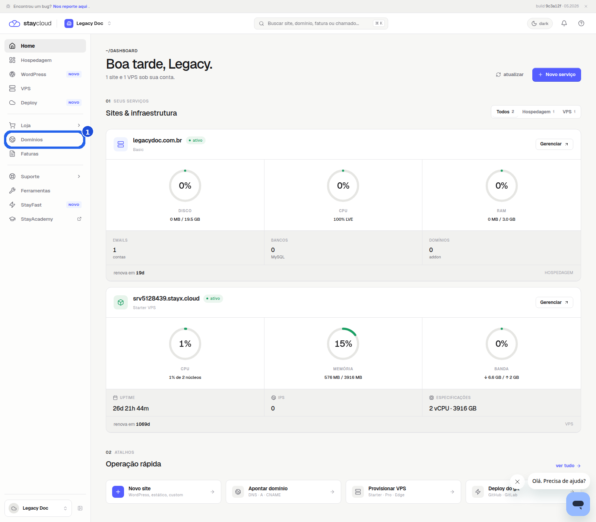
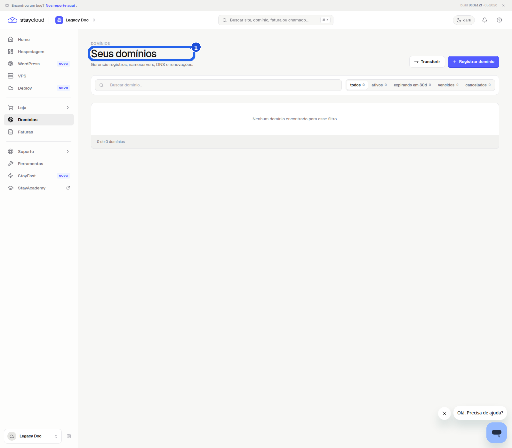
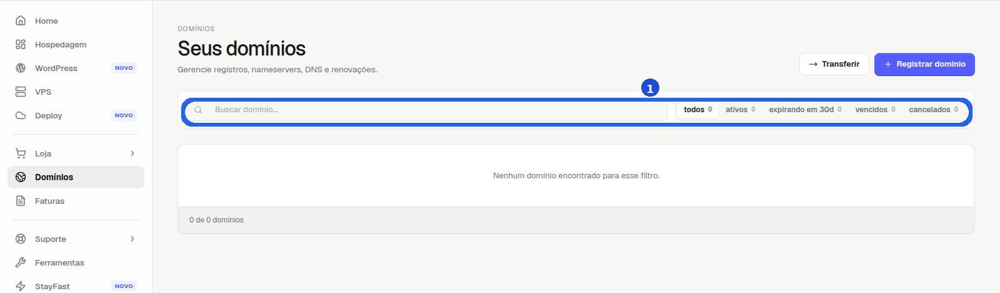
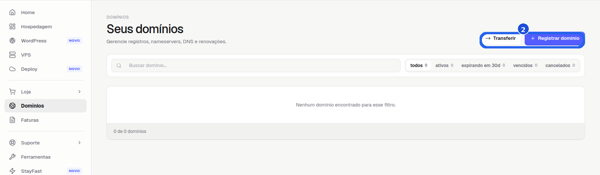

# Como acessar a área para adicionar domínios no Painel Novo da StayCloud

Use este passo a passo para localizar a área de domínios no Painel Novo da StayCloud. Aqui você só vai abrir a tela correta. Você não vai adicionar nenhum domínio nem salvar alteração.

## Quando usar este tutorial

Use este tutorial quando você quiser encontrar onde fica a opção de adicionar domínios e conferir a tela antes de iniciar qualquer cadastro.

## Antes de começar

- Entre na sua conta StayCloud.
- Confirme que você está no **Painel Novo**.
- Não preencha nenhum domínio.
- Se abrir uma etapa de cadastro, pare antes de enviar qualquer dado.

## Passo a passo

### 1. Acesse a tela inicial

Depois do login, observe o menu lateral. É nele que você encontra a área de domínios.

*Nesta tela, você começa pela navegação lateral e localiza a opção **Domínios**.*

### 2. Abra a área de domínios

Clique em **Domínios**. Na tela seguinte, você deve ver o título **Seus domínios**.

*Essa é a área correta para continuar. Você ainda não precisa preencher nada.*

### 3. Confira a lista e os filtros

Na parte superior da área, você vê a busca e os filtros dos domínios. Isso confirma que você chegou na tela certa.

*A busca e os filtros ajudam você a se localizar antes de avançar.*

### 4. Localize a opção para adicionar domínio

No canto superior direito, encontre **Registrar domínio** ou a opção equivalente da sua conta.

*Se abrir uma próxima etapa, pare antes de preencher qualquer informação.*

## Prints reais com marcações visuais

### Print 01

Tela inicial do Painel Novo. A marcação mostra onde fica o menu **Domínios**.

### Print 02

Área de Domínios aberta. A marcação destaca o título **Seus domínios**.

### Print 03

Barra de busca e filtros visíveis. A marcação mostra o ponto de referência da tela.

### Print 04

Botão **Registrar domínio** em destaque. Você para aqui antes de qualquer cadastro.

## Erros comuns

- Clicar em outro item do menu e não abrir a área de domínios.
- Passar pela tela sem conferir o título **Seus domínios**.
- Avançar para o cadastro sem querer concluir a ação.

## Quando abrir ticket

- Se a área de Domínios não aparecer no seu painel.
- Se a página não carregar corretamente.
- Se o botão **Registrar domínio** não aparecer.
- Se a interface mostrar um caminho diferente e você não souber qual opção usar.

## Conclusão

Agora você sabe onde encontrar a área para adicionar domínios no Painel Novo da StayCloud. Se quiser seguir, faça isso com atenção para não preencher dados antes da hora.

## SEO

- Palavra-chave: adicionar domínios painel novo staycloud
- Título SEO: Como acessar a área para adicionar domínios no Painel Novo da StayCloud
- Slug: como-acessar-area-adicionar-dominios-painel-novo-staycloud
- Meta description: Veja como localizar a área para adicionar domínios no Painel Novo da StayCloud sem alterar nenhuma configuração.
- Notas: foco 100% Painel Novo, sem cPanel, sem domínio real e sem salvar alterações.

## Checklists de validação

- [ ] Fala diretamente com você
- [ ] Usa linguagem simples
- [ ] Mostra onde clicar
- [ ] Mostra o que você deve ver na tela
- [ ] Usa prints reais
- [ ] Marcações visuais discretas e claras
- [ ] Sem cPanel
- [ ] Sem domínio real
- [ ] Sem salvar alteração
- [ ] ALT text definido

## Status

Rascunho local
