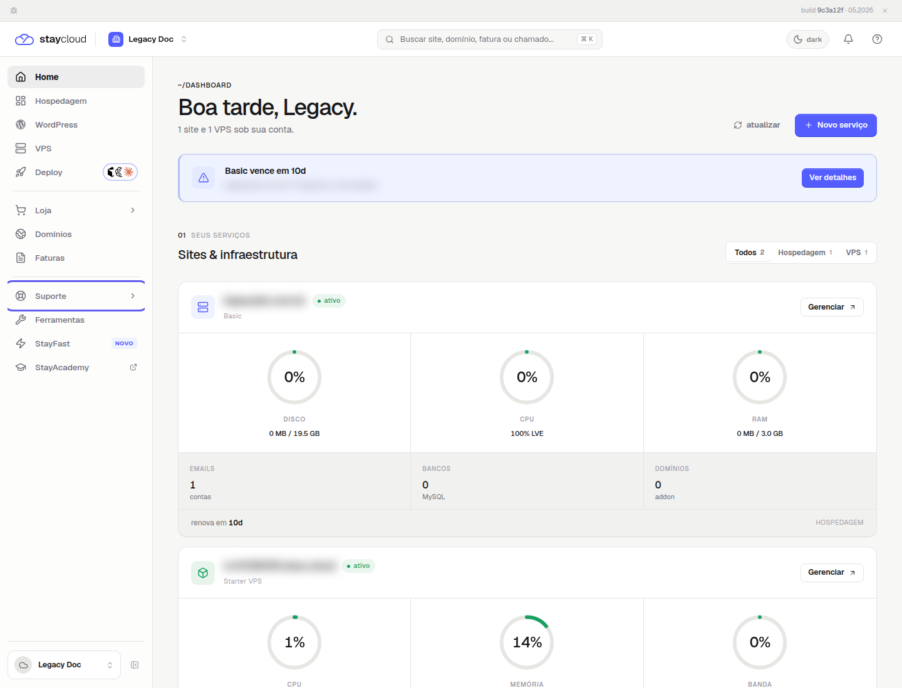
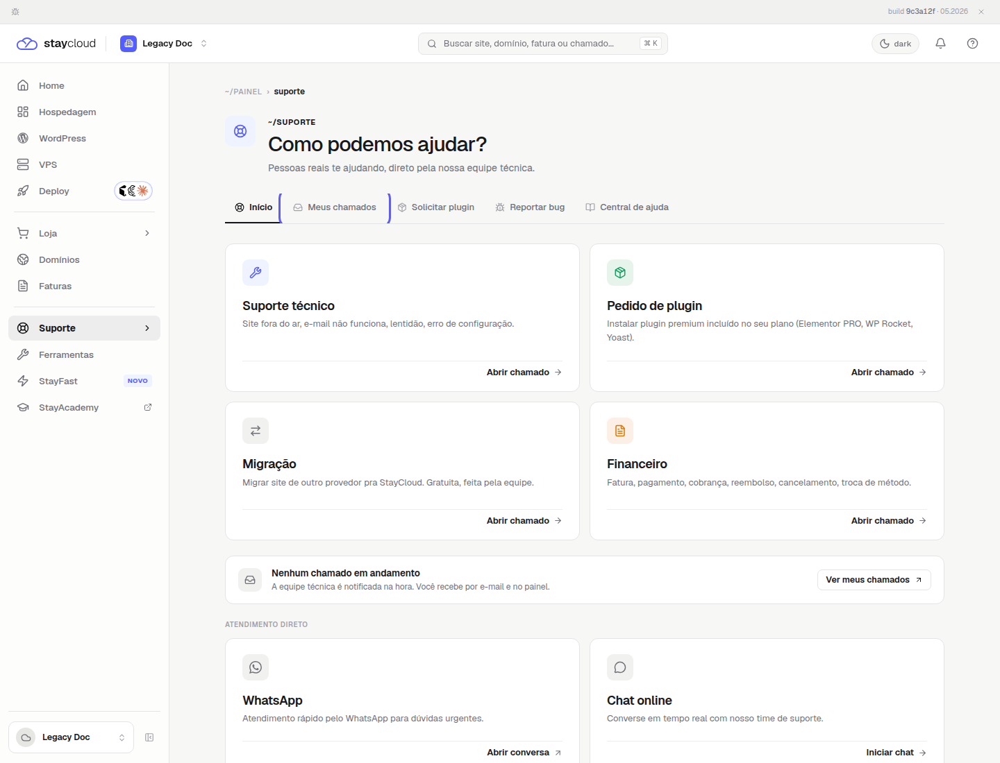
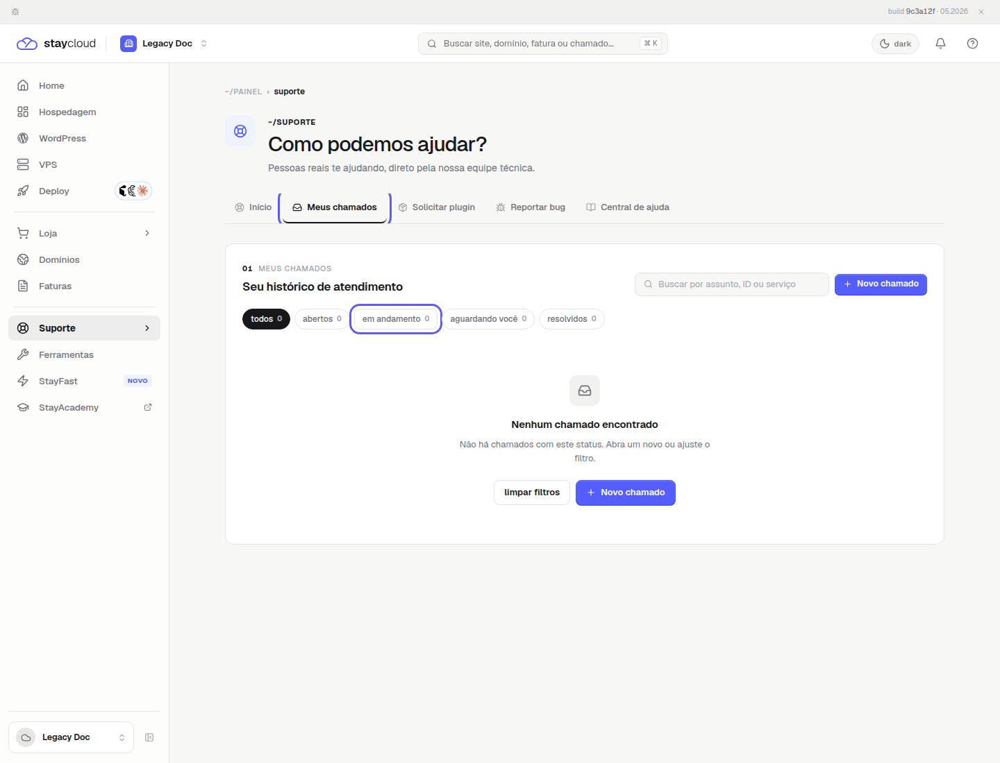

# Como acompanhar seus chamados no Painel Novo da StayCloud

Depois de abrir um chamado, você pode acompanhar o histórico e o status do atendimento pelo Painel Novo da StayCloud.

## Quando usar

Use este caminho para consultar chamados abertos, em andamento, aguardando você ou resolvidos.

## Antes de começar

- Entre no Painel Novo da StayCloud.
- Use a área de Suporte apenas para consultar o histórico neste tutorial.
- Não abra um novo chamado nem envie mensagens durante este procedimento.

## Passo a passo

### 1. Abra a área de Suporte

No menu lateral do painel, clique em **Suporte**. Essa área reúne as opções de atendimento e acompanhamento.

*Comece pela opção Suporte no menu lateral do painel.*

### 2. Selecione Meus chamados

Na área de Suporte, clique em **Meus chamados**. Essa opção mostra o histórico de atendimentos registrados em sua conta.

*Use Meus chamados para consultar atendimentos já registrados em sua conta.*

### 3. Confira o status do atendimento

Use os filtros acima da lista para localizar chamados abertos, em andamento, aguardando você ou resolvidos. Se a lista estiver vazia, confira se o filtro selecionado corresponde ao status que você procura.

*Use os filtros para localizar chamados abertos, em andamento, aguardando você ou resolvidos.*

## Erros comuns

- Entrar em uma conta diferente daquela usada para abrir o chamado.
- Procurar o histórico fora da área **Suporte**.
- Deixar selecionado um filtro que impede a exibição do chamado.
- Não possuir nenhum chamado no status selecionado.

## Quando abrir um novo chamado

Abra um novo chamado somente quando tiver uma nova solicitação ou um problema diferente. Para consultar um atendimento existente, use **Meus chamados**.

## Conclusão

Agora você sabe onde consultar seus chamados e como acompanhar o status de cada atendimento pelo Painel Novo da StayCloud.

> Este Markdown é somente a fonte editorial. Para publicar, usar exclusivamente `publicacao/01 - Conteudo WordPress.html`.
