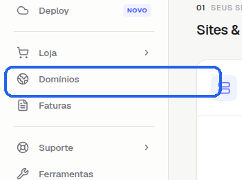
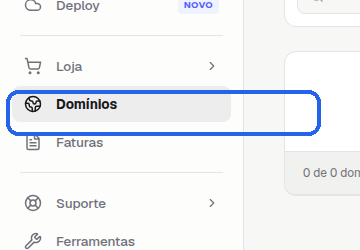
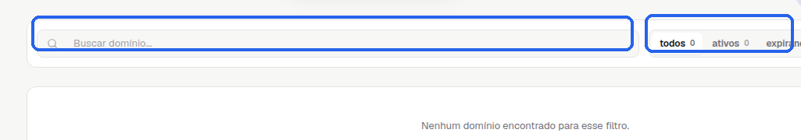
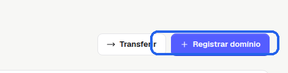

# Como acessar a área para adicionar domínios no Painel Novo da StayCloud

Se você quer localizar a área certa para adicionar domínios na StayCloud, este tutorial mostra o caminho dentro do Painel Novo sem fazer nenhuma alteração na conta.

## Quando usar este tutorial

Use este passo a passo quando você quiser:

- encontrar a área de domínios no Painel Novo;
- ver onde fica a opção de adicionar domínio;
- conferir a tela correta antes de iniciar um cadastro;
- evitar clicar na área errada do painel.

## Antes de começar

- Entre na sua conta StayCloud.
- Confirme que você está no Painel Novo.
- Não preencha nenhum domínio neste tutorial.
- Não avance se a tela mostrar uma etapa de confirmação que você ainda não quer concluir.

## Passo a passo

### 1. Abra o Painel Novo

Depois do login, você chega à tela inicial do Painel Novo. É aqui que começa a navegação.

*Nesta tela, você começa pelo menu lateral e procura a opção relacionada a Domínios.*

### 2. Localize o menu Domínios

No menu lateral, clique em **Domínios**.

*Esse é o menu que leva você para a área onde os domínios ficam organizados.*

### 3. Abra a área de Domínios

Ao entrar na área, você deve ver o título **Seus domínios** e a lista de domínios da conta.

*Essa é a tela correta para confirmar que você chegou na área de domínios e localizar a busca da lista.*

### 4. Encontre a opção para adicionar domínio

Na parte superior da tela, localize a opção **Registrar domínio**, **Adicionar domínio** ou nome equivalente exibido na sua conta.

*Se a tela abrir uma próxima etapa, pare antes de preencher qualquer dado. Este tutorial termina aqui, porque o objetivo é apenas mostrar onde fica a área.*

## Erros comuns

- Clicar em outro item do menu e não abrir a área de domínios.
- Passar direto pela tela sem confirmar o título **Seus domínios**.
- Avançar para uma etapa de cadastro sem querer concluir a ação.

## Quando abrir ticket

Abra um ticket se:

- a área de Domínios não aparecer no seu painel;
- a página não carregar corretamente;
- a opção de adicionar domínio não aparecer;
- o texto do botão estiver diferente e você não souber qual caminho seguir.

## Conclusão

Agora você sabe onde encontrar a área para adicionar domínios no Painel Novo da StayCloud e como parar no ponto certo antes de qualquer alteração.

## SEO

- **Palavra-chave:** adicionar domínios painel novo staycloud
- **Título SEO:** Como acessar a área para adicionar domínios no Painel Novo da StayCloud
- **Slug:** como-acessar-area-adicionar-dominios-painel-novo-staycloud
- **Meta description:** Veja como localizar a área para adicionar domínios no Painel Novo da StayCloud sem alterar nenhuma configuração.

## Checklists de validação

### Checklist SEO Rank Math

- Palavra-chave definida
- Título claro e direto
- Slug curto e consistente
- Meta description objetiva
- Palavra-chave na introdução
- Palavra-chave em um subtítulo quando fizer sentido

### Checklist UI/UX

- Fala direta com você
- Passos curtos e lógicos
- Mostra onde clicar
- Explica o que aparece na tela
- Diz quando parar antes de concluir qualquer etapa
- Leitura simples para quem não conhece o painel

### Checklist visual/prints

- Prints reais
- Menu Domínios marcado
- Área de Domínios marcada
- Botão de ação marcado
- Legendas curtas
- ALT text definido
- Sem dado sensível exposto

### Checklist final antes do WordPress

- Texto revisado para leitura pública
- Sem linguagem interna
- Sem dado sensível
- Sem placeholder de print
- HTML preview confere com os prints
- HTML WordPress limpo

## Status

Rascunho local.
