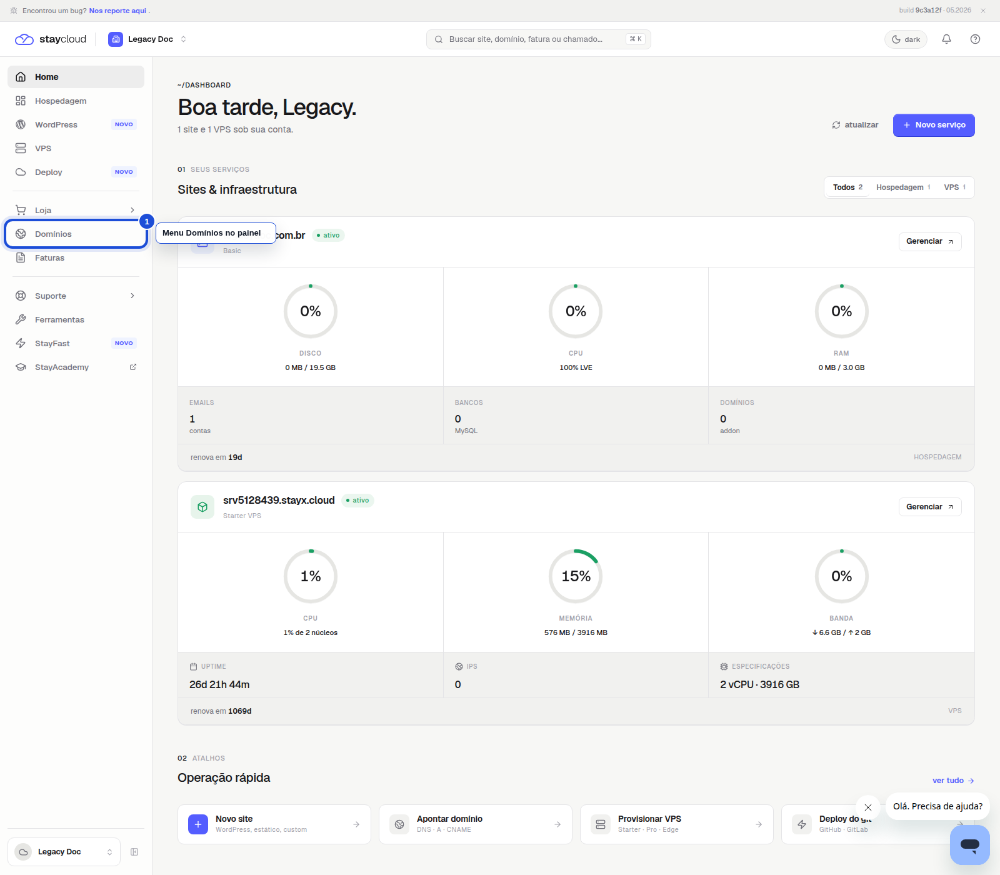
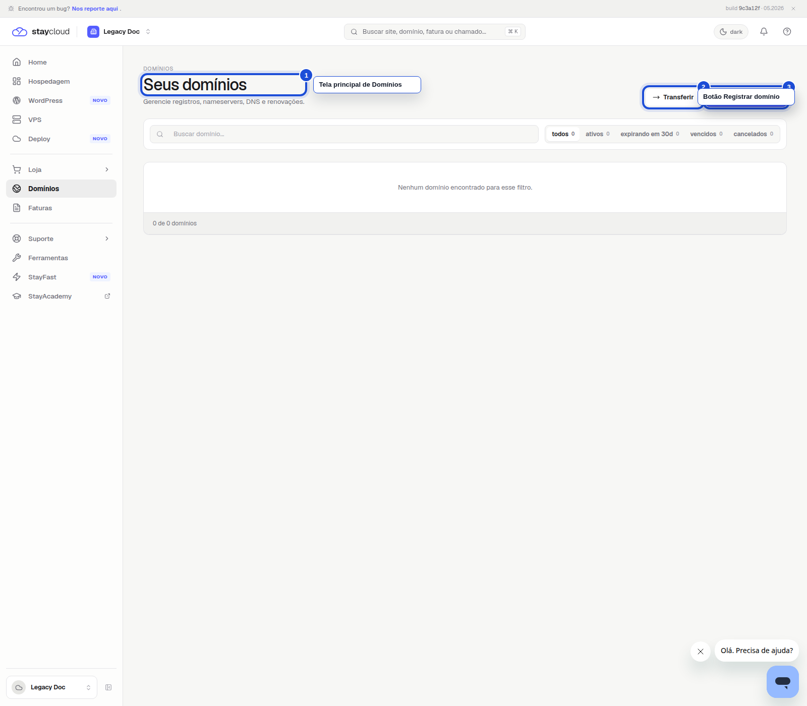
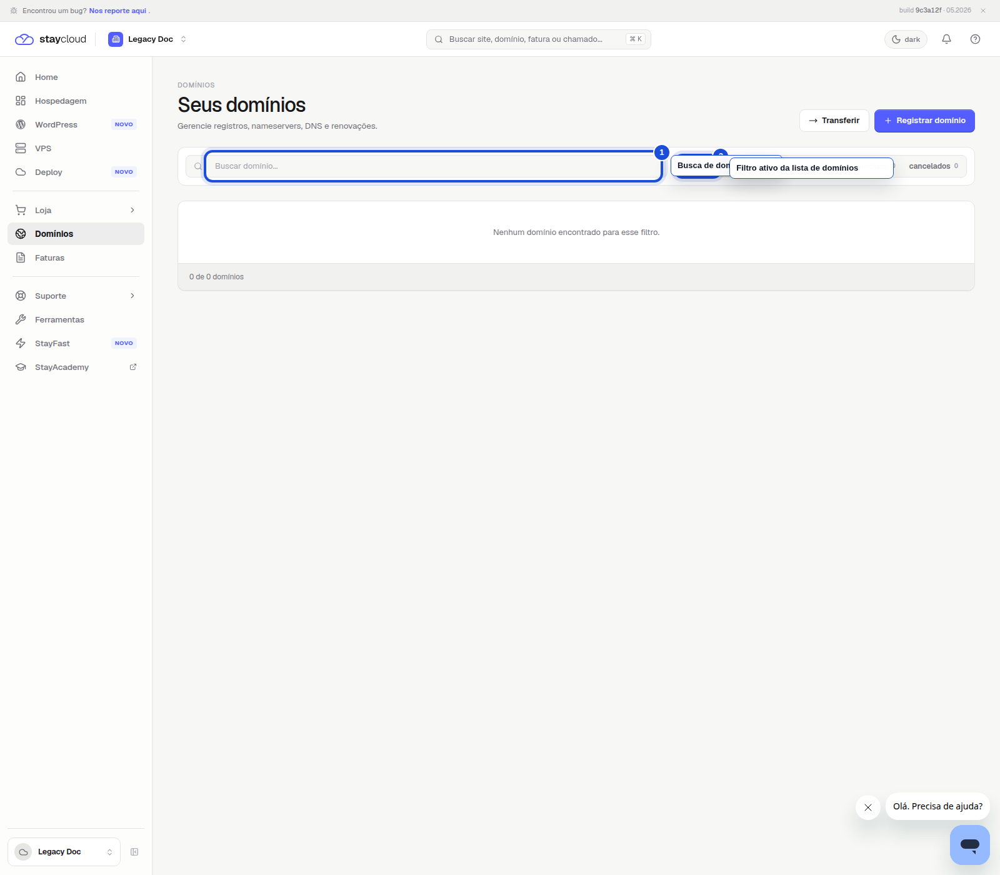

# Como localizar o menu Domínios no Painel Novo da StayCloud

Se você quer acessar a area de domínios da sua conta, este tutorial mostra onde encontrar o menu Domínios no Painel Novo da StayCloud e como confirmar que chegou na pagina correta.

## Quando usar este tutorial

Use este passo a passo quando você quiser:

- abrir a area de domínios;
- conferir a lista de domínios da conta;
- registrar um novo domínio;
- transferir um domínio;
- localizar a busca de domínios no Painel Novo.

## Antes de começar

Antes de seguir, entre na sua conta da StayCloud e confirme que você está no Painel Novo.

Se a página inicial ainda estiver carregando, aguarde alguns segundos antes de clicar em outra opção.

## Passo a passo

### 1. Abra o Painel Novo

Depois do login, você vê o menu lateral e a lista principal da sua conta.

*Nesta tela, localize e clique em Domínios no menu lateral.*

### 2. Acesse a area de Domínios

Ao clicar em Domínios, a página abre com o título **Seus domínios**.

*Essa é a tela correta para ver e gerenciar os domínios da sua conta.*

### 3. Confira os recursos da pagina

Na parte superior da area de Domínios, você encontra a busca e os filtros para localizar o que precisa com mais facilidade.

*Use a busca para localizar um domínio específico e veja os filtros disponíveis na parte superior.*

## Erros comuns

- Clicar em outro item do menu e não abrir a área de domínios.
- Procurar por cPanel, quando o caminho certo está no Painel Novo.
- Passar direto pela tela sem confirmar o título **Seus domínios**.
- Confundir a tela de domínios com outras áreas do painel.

## Quando abrir ticket

Abra um ticket quando:

- a área de Domínios não aparecer no seu painel;
- a página não carregar corretamente;
- a lista de domínios não mostrar o que você espera;
- você precisar de ajuda para transferir ou registrar um domínio.

Se a opção não aparecer, use a área de suporte do Painel Novo para pedir ajuda.

## Conclusão

Agora você sabe onde encontrar o menu Domínios no Painel Novo da StayCloud e como confirmar que entrou na página correta.

## SEO

- **Palavra-chave:** menu domínios painel novo staycloud
- **Título SEO:** Como localizar o menu Domínios no Painel Novo da StayCloud
- **Slug:** como-localizar-menu-dominios-painel-novo-staycloud
- **Meta description:** Veja como encontrar o menu Domínios no Painel Novo da StayCloud e acessar as informações dos seus domínios.

## Checklists de validação

### Checklist SEO Rank Math

- Palavra-chave definida
- Título claro e direto
- Slug curto e consistente
- Meta description objetiva
- Palavra-chave na introdução
- Estrutura simples para leitura rápida

### Checklist UI/UX

- Fala direta com você
- Passos curtos e lógicos
- Mostra onde clicar
- Explica o que aparece na tela
- Indica o que fazer se algo não aparecer
- Leitura simples para quem não conhece o painel

### Checklist visual/prints

- Prints reais
- Menu Domínios marcado
- Título da área marcado
- Busca e filtros marcados
- Legendas curtas
- ALT text definido
- Sem dado sensível exposto

### Checklist final antes do WordPress

- Texto revisado para leitura pública
- Sem linguagem interna
- Sem cPanel
- Sem dado sensível
- Sem placeholder de print
- HTML preview confere com os prints
- HTML WordPress limpo

## Status

Rascunho local.
