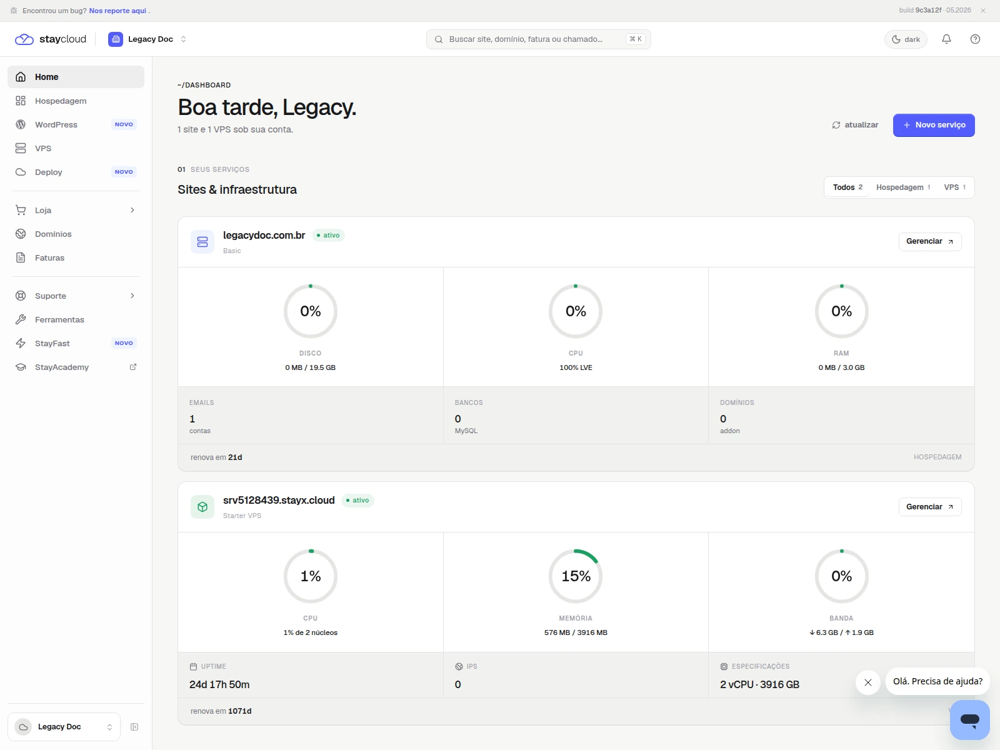
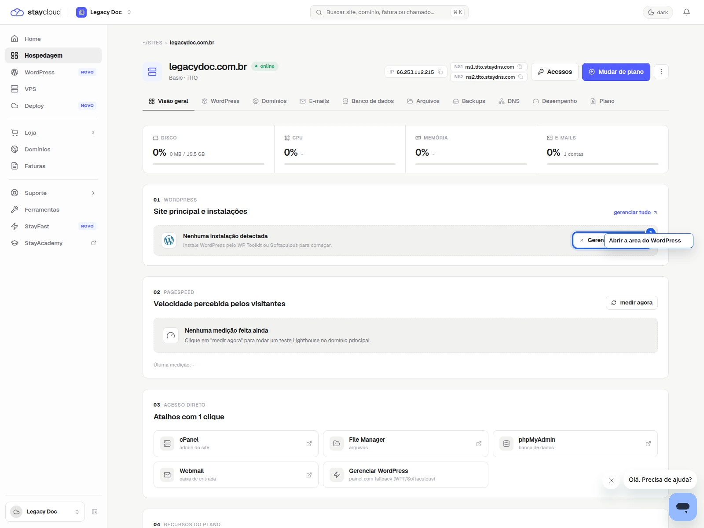
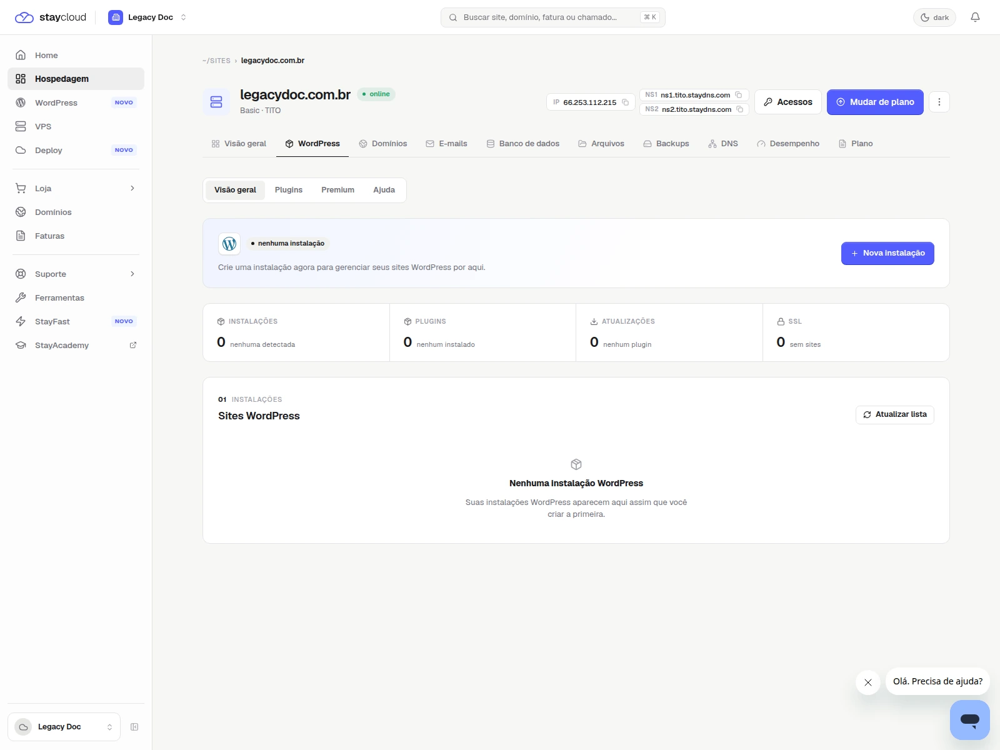
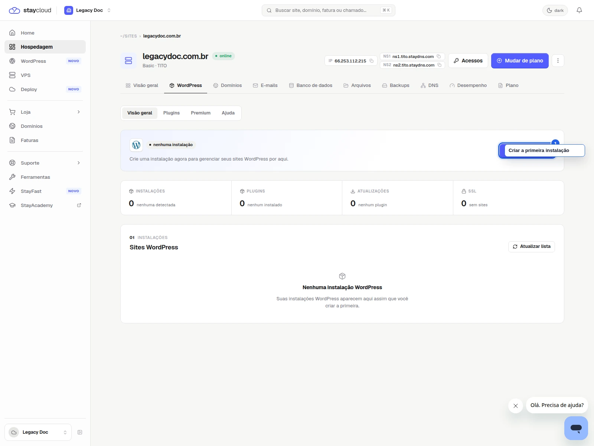

# Como acessar o WordPress pelo Painel Novo da StayCloud

## Status

Rascunho local com prints reais capturados.

## Objetivo

Aprenda a localizar sua hospedagem e abrir o acesso ao WordPress pelo Painel Novo da StayCloud com mais segurança.

## Para quem é

- para você que precisa entrar no WordPress com rapidez;
- para você que já está no Painel Novo e não sabe onde fica o acesso;
- para você que quer seguir o fluxo correto sem se confundir entre serviços;
- para você que está iniciando uma nova instalação do WordPress.

## Quando usar

Use este tutorial quando precisar acessar o WordPress pela área da hospedagem no Painel Novo.

## Antes de começar

- tenha sua conta aberta na StayCloud;
- confirme qual hospedagem você quer gerenciar;
- use um navegador no desktop;
- mantenha sua sessão segura;
- não compartilhe dados sensíveis.

## Palavra-chave

como acessar o WordPress pelo Painel Novo da StayCloud

## SEO

- **Título SEO:** Como acessar o WordPress pelo Painel Novo da StayCloud
- **Slug:** como-acessar-wordpress-painel-novo-staycloud
- **Meta description:** Veja como acessar o WordPress pelo Painel Novo da StayCloud, localizar sua hospedagem e abrir o site com mais segurança.

## Passo a passo

### 1. Abra o Painel Novo e localize sua hospedagem

Entre no Painel Novo e encontre a hospedagem que deseja gerenciar antes de seguir.

### 2. Clique em Gerenciar na hospedagem correta

Abra a visão da hospedagem que você quer configurar. Assim, você continua no ambiente certo.

### 3. Localize a área de WordPress

Na tela da hospedagem, procure a área de WordPress ou o bloco equivalente de gerenciamento.

Se aparecer **Nenhuma instalação detectada**, siga para a criação da primeira instalação.

### 4. Abra o acesso ou inicie a primeira instalação

Use a opção disponível para abrir o WordPress da hospedagem selecionada ou iniciar a primeira instalação, se ainda não houver uma ativa.

## Onde entram os prints

- Print 01: tela inicial com sua hospedagem em destaque.
- Print 02: botão Gerenciar na hospedagem certa.
- Print 03: área de WordPress sem instalação detectada.
- Print 04: ação para abrir o WordPress ou iniciar a instalação.

## Legenda e instrução dos prints

- Print 01: mostra onde você confirma a hospedagem antes de continuar.
- Print 02: mostra o ponto certo para acessar a hospedagem escolhida.
- Print 03: mostra como a área de WordPress aparece quando ainda não há instalação.
- Print 04: mostra a ação final para abrir o acesso ou criar a primeira instalação.

## Alerta de dados sensíveis

- esconda usuário, senha, tokens e cookies;
- não mostre dados de administração reais;
- não exiba domínio incorreto se isso puder confundir;
- não capture telas de terceiros.

## Erros comuns

- clicar na hospedagem errada quando há mais de uma conta;
- procurar o WordPress sem abrir a hospedagem correta;
- confundir a área de WordPress com outra seção do painel;
- interpretar a mensagem de ausência de instalação como erro;
- usar zoom excessivo e perder o contexto da tela.

## Quando abrir ticket

- se o WordPress não aparecer na hospedagem correta;
- se sua conta não permitir abrir o acesso;
- se a página carregar com erro;
- se o painel mostrar algo diferente do fluxo descrito aqui.

## Conclusão

Quando você começa pela hospedagem correta e confirma a área de WordPress antes de seguir, o acesso fica mais simples e seguro.

## Checklist SEO Rank Math

- [x] palavra-chave principal definida
- [x] título SEO definido
- [x] slug definido
- [x] meta description definida
- [x] palavra-chave presente no título
- [x] palavra-chave presente na introdução
- [x] palavra-chave presente no slug
- [x] meta description clara e útil
- [x] objetivo acima de 80 considerado

## Checklist UI/UX

- [x] objetivo claro em poucos segundos
- [x] ordem dos passos lógica
- [x] você sabe onde clicar
- [x] a linguagem está simples
- [x] há orientação quando algo não aparece
- [x] o fluxo reduz fricção

## Checklist visual/prints

- [x] contexto suficiente
- [x] sem dados sensíveis
- [x] foco visual claro
- [x] marcação útil
- [x] sem corte excessivo
- [x] sem zoom excessivo

## Checklist final antes do WordPress

- [x] rascunho local concluído
- [x] SEO definido
- [x] UI/UX validado
- [x] print plan criado
- [x] HTML preview criado
- [x] HTML WordPress criado
- [x] sem publicação
- [x] sem mídia no WordPress

## Validação interna

- **Agente Tutorial StayCloud:** aprovado com ajustes
- **Agente SEO Rank Math:** aprovado com ajustes
- **Agente Visual e Prints:** aprovado com ajustes
- **Agente UI/UX Experience:** aprovado com ajustes
- **Agente Redator:** aprovado
- **Agente Segurança:** aprovado
- **Agente Auditor:** aprovado com ajustes
- **Quality Gate:** aprovado com ajustes

## Observações

O print real foi capturado em conta de teste. A tela de WordPress mostra o caso sem instalação detectada, então o texto cobre também a primeira instalação.
