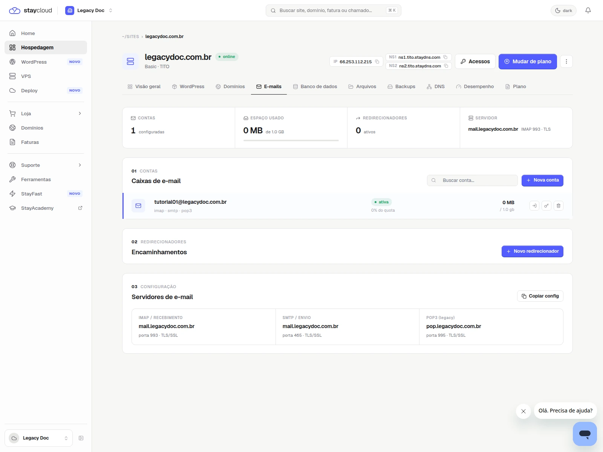
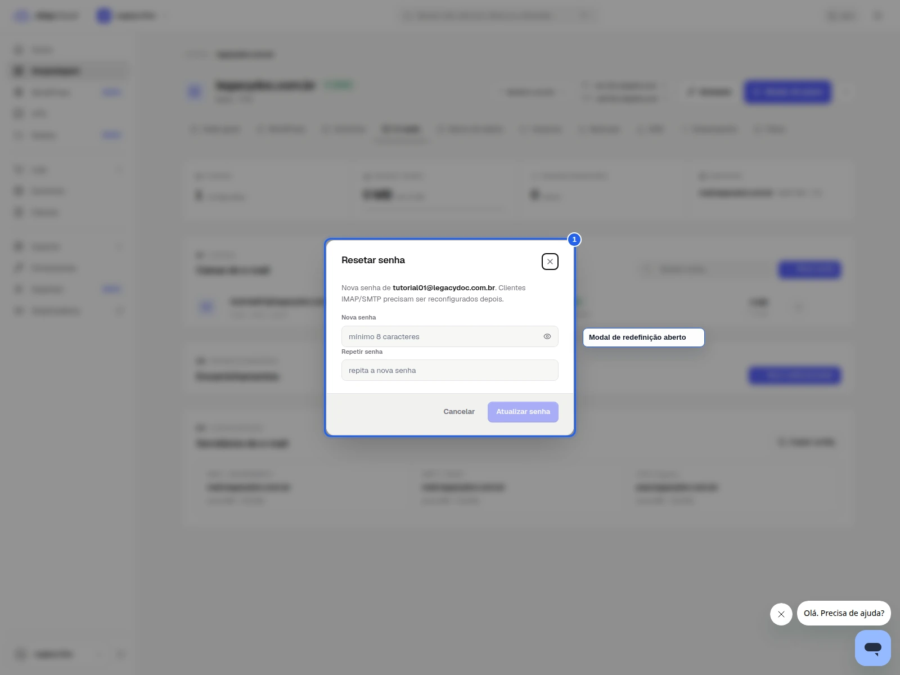
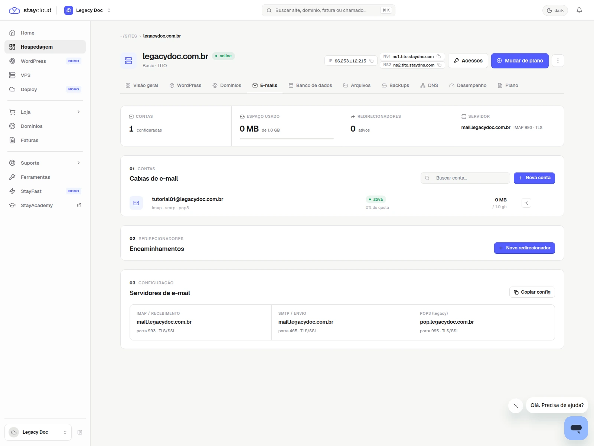

# Como alterar a senha de e-mail no Painel Novo da StayCloud

## Status

Rascunho local com prints reais capturados.

## Objetivo

Aprenda a localizar sua conta de e-mail e alterar a senha no Painel Novo com segurança.

## Para quem é

- para você que esqueceu a senha do e-mail;
- para você que precisa atualizar a senha de uma conta específica;
- para você que quer seguir um fluxo claro sem confundir a conta;
- para você que também precisa orientar a configuração do aplicativo de e-mail depois da alteração.

## Quando usar

Use este tutorial quando precisar alterar a senha de uma conta de e-mail vinculada à sua hospedagem.

## Antes de começar

- tenha sua conta aberta na StayCloud;
- confirme qual hospedagem contém o e-mail;
- use um navegador no desktop;
- mantenha sua sessão segura;
- não compartilhe credenciais.

## Palavra-chave

como alterar a senha de e-mail no Painel Novo da StayCloud

## SEO

- **Título SEO:** Como alterar a senha de e-mail no Painel Novo da StayCloud
- **Slug:** como-alterar-senha-email-painel-novo-staycloud
- **Meta description:** Veja como alterar a senha de e-mail no Painel Novo da StayCloud, localizar a conta certa e concluir a atualização com segurança.

## Passo a passo

### 1. Abra a hospedagem correta

Entre no Painel Novo e localize a hospedagem onde a conta de e-mail está cadastrada.

### 2. Acesse a área de e-mails

Na hospedagem, abra a área de e-mails para ver as contas disponíveis.

### 3. Escolha a conta correta

Confirme o endereço antes de iniciar a troca da senha.

### 4. Redefina a senha

Use a ação disponível para alterar a senha e confirme a atualização.

### 5. Confirme a alteração concluída e a configuração relacionada

Mostre a confirmação final sem expor a senha nova ou qualquer dado sensível. Se você também precisar configurar o aplicativo de e-mail, use a visão de configuração do servidor como referência complementar.

## Onde entram os prints

- Print 01: tela inicial com sua hospedagem em destaque.
- Print 02: área de e-mails aberta.
- Print 03: conta correta selecionada.
- Print 04: ação de redefinição de senha.
- Print 05: confirmação final e apoio de configuração.

## Legenda e instrução dos prints

- Print 01: mostra o contexto da hospedagem antes da alteração.
- Print 02: mostra onde a conta de e-mail aparece.
- Print 03: mostra a conta certa antes da troca da senha.
- Print 04: mostra a ação de senha sem expor a nova senha.
- Print 05: mostra a confirmação final e, se necessário, a referência de configuração.

## Alerta de dados sensíveis

- esconda senha atual e nova senha;
- não capture cookies, token ou sessões;
- não mostre dados de outra conta;
- não publique o endereço completo se isso não for necessário.

## Erros comuns

- alterar a senha na conta errada;
- não localizar a área de e-mails;
- confundir o endereço do e-mail com outro da hospedagem;
- mostrar o modal inteiro sem ocultar campos sensíveis.

## Quando abrir ticket

- se a conta de e-mail não aparecer;
- se a hospedagem não mostrar a área de e-mail;
- se sua conta não permitir alterar a senha;
- se o sistema mostrar erro ao salvar a nova senha.

## Conclusão

Quando você abre a conta certa e encontra a área de e-mails com clareza, a troca de senha fica objetiva e segura.

## Checklist SEO Rank Math

- [x] palavra-chave principal definida
- [x] título SEO definido
- [x] slug definido
- [x] meta description definida
- [x] palavra-chave presente no título
- [x] palavra-chave presente na introdução
- [x] palavra-chave presente no slug
- [x] meta description clara e útil
- [x] objetivo acima de 80 considerado

## Checklist UI/UX

- [x] objetivo claro em poucos segundos
- [x] ordem dos passos lógica
- [x] você sabe onde clicar
- [x] a linguagem está simples
- [x] há orientação quando algo não aparece
- [x] o fluxo reduz fricção

## Checklist visual/prints

- [x] contexto suficiente
- [x] sem dados sensíveis
- [x] foco visual claro
- [x] marcação útil
- [x] sem corte excessivo
- [x] sem zoom excessivo

## Checklist final antes do WordPress

- [x] rascunho local concluído
- [x] SEO definido
- [x] UI/UX validado
- [x] print plan criado
- [x] HTML preview criado
- [x] HTML WordPress criado
- [x] sem publicação
- [x] sem mídia no WordPress

## Validação interna

- **Agente Tutorial StayCloud:** aprovado com ajustes
- **Agente SEO Rank Math:** aprovado com ajustes
- **Agente Visual e Prints:** aprovado com ajustes
- **Agente UI/UX Experience:** aprovado com ajustes
- **Agente Redator:** aprovado
- **Agente Segurança:** aprovado
- **Agente Auditor:** aprovado com ajustes
- **Quality Gate:** aprovado com ajustes

## Observações

O fluxo foi capturado em conta de teste e inclui uma visão complementar de configuração do servidor para o caso em que você também precise ajustar o app de e-mail.
