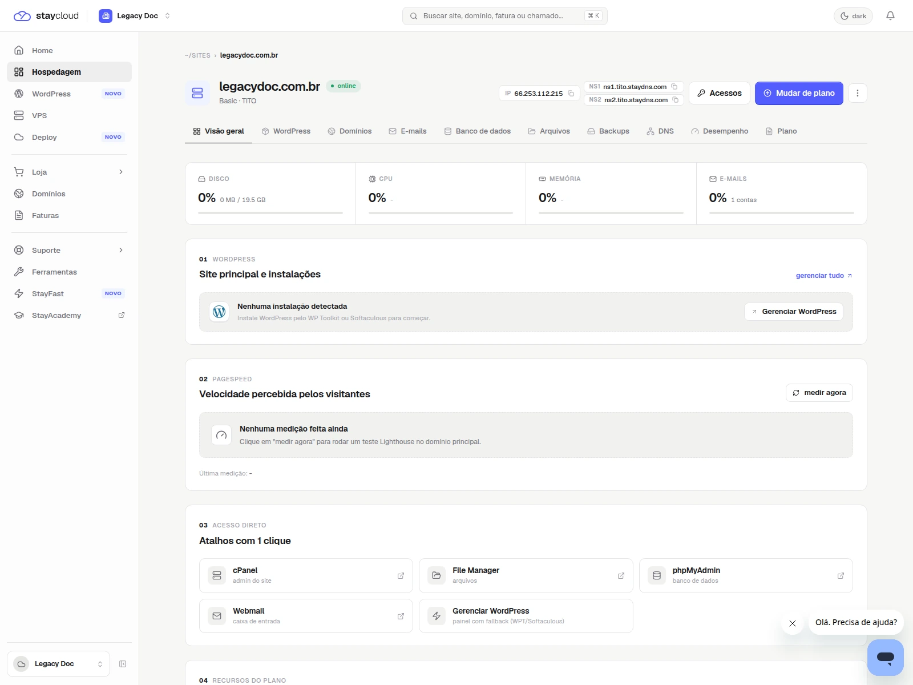
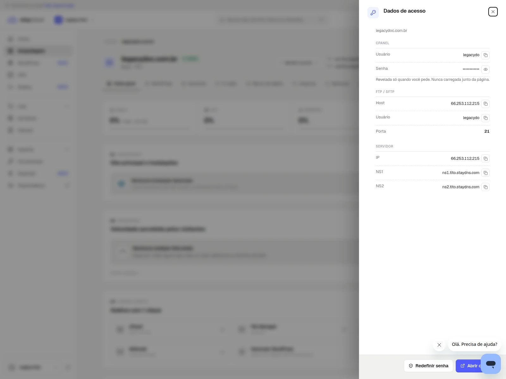
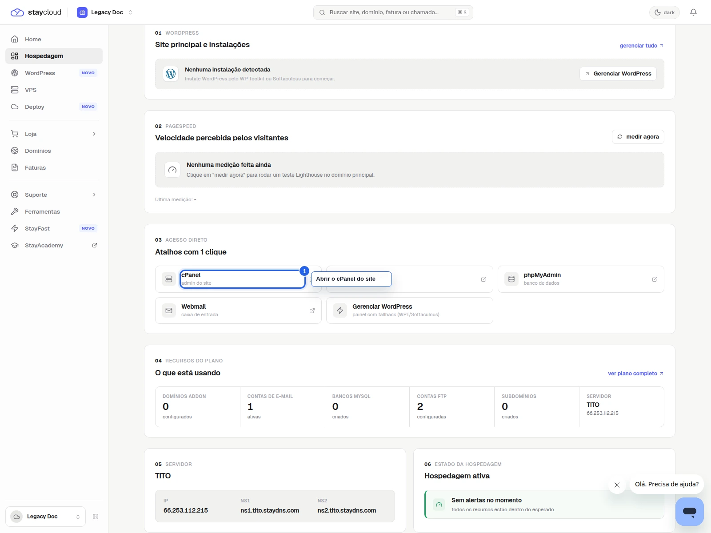
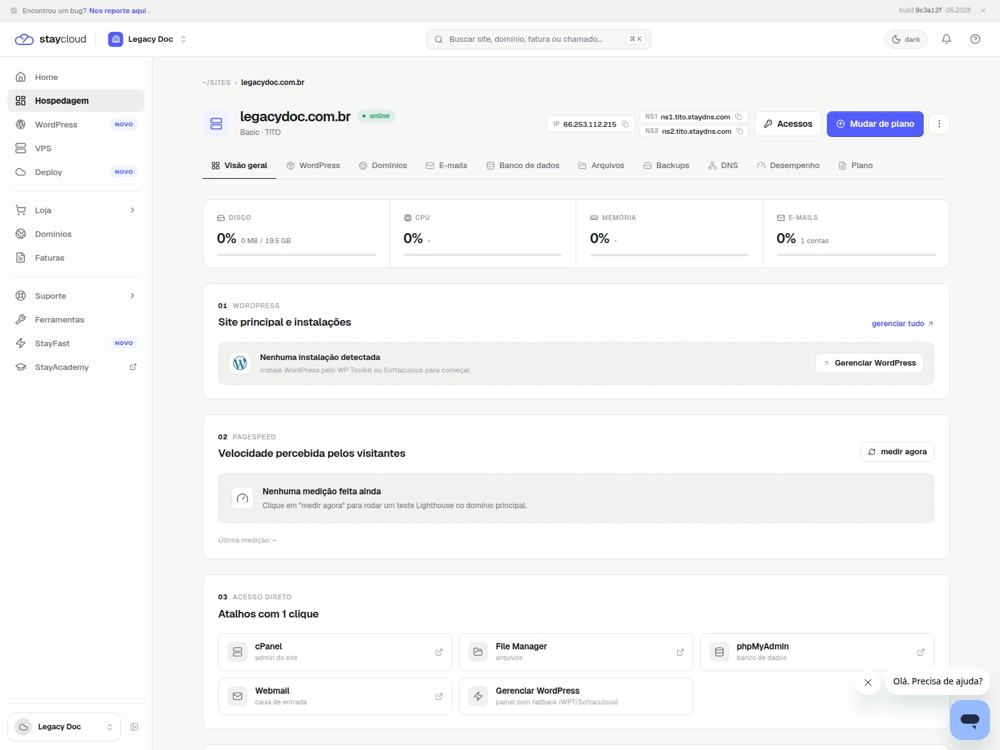

# Como encontrar dados do servidor no Painel Novo da StayCloud

## Status

Rascunho local com prints reais capturados.

## Objetivo

Aprenda a localizar IP, DNS, cPanel e outras informações da sua hospedagem no Painel Novo sem expor credenciais.

## Para quem é

- para você que precisa copiar dados do servidor;
- para você que quer encontrar informações técnicas com mais rapidez;
- para você que deseja consultar a área de acessos da hospedagem;
- para você que quer confirmar os dados antes de seguir com uma configuração.

## Quando usar

Use este tutorial quando precisar consultar dados técnicos da hospedagem no Painel Novo.

## Antes de começar

- tenha sua conta aberta na StayCloud;
- confirme qual hospedagem você quer consultar;
- use um navegador no desktop;
- mantenha sua sessão segura;
- não compartilhe dados sensíveis.

## Palavra-chave

como encontrar dados do servidor no Painel Novo da StayCloud

## SEO

- **Título SEO:** Como encontrar dados do servidor no Painel Novo da StayCloud
- **Slug:** como-encontrar-dados-servidor-painel-novo-staycloud
- **Meta description:** Veja como encontrar dados do servidor no Painel Novo da StayCloud, revisar IP, DNS e cPanel e copiar a informação certa sem confusão.

## Passo a passo

### 1. Abra a hospedagem correta

Entre no Painel Novo e abra a hospedagem que deseja consultar antes de seguir.

### 2. Abra a área de acessos

Na hospedagem, localize a área de acessos. É nela que costumam aparecer cPanel, FTP e dados do servidor.

### 3. Revise os campos disponíveis

Confira os campos exibidos na tela e copie apenas as informações necessárias para o que você precisa fazer.

### 4. Confirme o contexto do servidor

Use a visão complementar para validar que você está olhando a hospedagem certa antes de continuar.

## Onde entram os prints

- Print 01: tela inicial com sua hospedagem em destaque.
- Print 02: área de acessos aberta.
- Print 03: campos técnicos visíveis na tela.
- Print 04: confirmação do contexto do servidor.

## Legenda e instrução dos prints

- Print 01: mostra onde você começa antes de abrir os dados.
- Print 02: mostra a área onde as informações operacionais aparecem.
- Print 03: mostra os campos técnicos que você pode consultar.
- Print 04: mostra a confirmação final do servidor certo.

## Alerta de dados sensíveis

- esconda senha, token, cookie e qualquer campo secreto;
- se o IP ou o domínio gerar exposição desnecessária, ofusque;
- não mostre ambientes de terceiros;
- não registre dados reais no histórico.

## Erros comuns

- abrir a hospedagem errada;
- procurar os dados no lugar errado do painel;
- confundir IP com DNS ou cPanel;
- deixar a tela sem contexto suficiente.

## Quando abrir ticket

- se a área de dados não aparecer;
- se a hospedagem estiver incompleta;
- se o painel não mostrar o acesso esperado;
- se você não souber qual informação precisa copiar.

## Conclusão

Quando você abre a hospedagem correta e encontra a área de dados com clareza, fica mais fácil localizar a informação que precisa.

## Checklist SEO Rank Math

- [x] palavra-chave principal definida
- [x] título SEO definido
- [x] slug definido
- [x] meta description definida
- [x] palavra-chave presente no título
- [x] palavra-chave presente na introdução
- [x] palavra-chave presente no slug
- [x] meta description clara e útil
- [x] objetivo acima de 80 considerado

## Checklist UI/UX

- [x] objetivo claro em poucos segundos
- [x] ordem dos passos lógica
- [x] você sabe onde clicar
- [x] a linguagem está simples
- [x] há orientação quando algo não aparece
- [x] o fluxo reduz fricção

## Checklist visual/prints

- [x] contexto suficiente
- [x] sem dados sensíveis
- [x] foco visual claro
- [x] marcação útil
- [x] sem corte excessivo
- [x] sem zoom excessivo

## Checklist final antes do WordPress

- [x] rascunho local concluído
- [x] SEO definido
- [x] UI/UX validado
- [x] print plan criado
- [x] HTML preview criado
- [x] HTML WordPress criado
- [x] sem publicação
- [x] sem mídia no WordPress

## Validação interna

- **Agente Tutorial StayCloud:** aprovado com ajustes
- **Agente SEO Rank Math:** aprovado com ajustes
- **Agente Visual e Prints:** aprovado com ajustes
- **Agente UI/UX Experience:** aprovado com ajustes
- **Agente Redator:** aprovado
- **Agente Segurança:** aprovado
- **Agente Auditor:** aprovado com ajustes
- **Quality Gate:** aprovado com ajustes

## Observações

O fluxo cobre a área de acessos e usa uma visão complementar para reforçar que você está na hospedagem certa antes de continuar.
