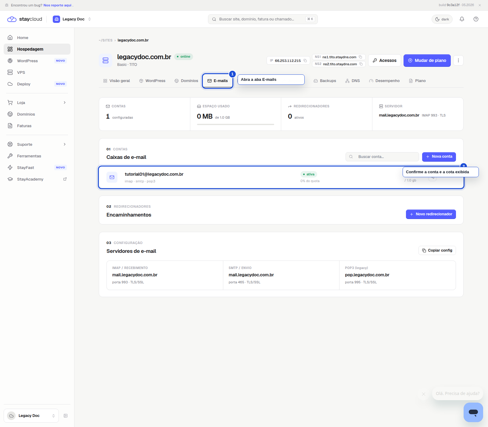
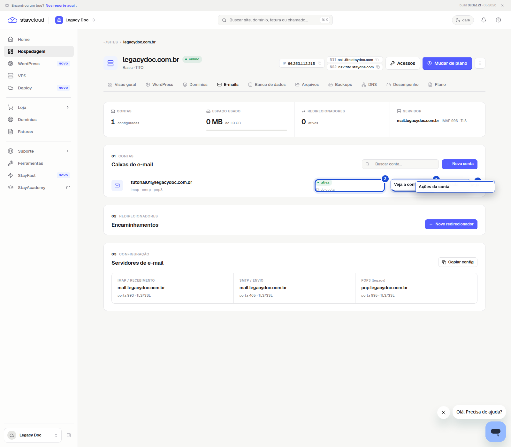

# Como alterar o armazenamento dos e-mails no Painel Novo da StayCloud

## Status

Rascunho local com prints reais capturados.

## Objetivo

Abra a hospedagem correta no Painel Novo, entre em E-mails e confira o armazenamento da conta. Se a sua interface mostrar a edição da cota, siga por ela; nesta build, a alteração direta não apareceu.

## Para quem é

- para você que precisa ampliar ou reduzir o espaço de uma conta de e-mail
- para você que quer conferir a conta certa antes de salvar a alteração
- para você que deseja seguir o caminho do Painel Novo sem se perder

## Quando usar

Use este tutorial quando precisar alterar o limite de armazenamento de uma conta de e-mail vinculada à sua hospedagem.

## Antes de começar

- tenha acesso ao Painel Novo da StayCloud
- confirme qual hospedagem contém a conta que você quer ajustar
- use um navegador no desktop
- não altere o valor sem entender o limite do seu plano
- nesta build, a aba E-mails mostra a cota atual, mas não exibiu um botão de editar armazenamento

## Palavra-chave

alterar armazenamento dos e-mails no Painel Novo

## SEO

- **Título SEO:** Como alterar o armazenamento dos e-mails no Painel Novo da StayCloud
- **Slug:** como-alterar-o-armazenamento-dos-e-mails-no-painel-novo-da-staycloud
- **Meta description:** Veja como conferir o armazenamento dos e-mails no Painel Novo da StayCloud, entender o limite exibido e saber quando abrir ticket para aumentar a cota.

## Passo a passo

### 1. Abra a hospedagem correta no Painel Novo

Entre no Painel Novo e selecione a hospedagem que contém a conta de e-mail que você deseja ajustar.

Primeiro confirme a hospedagem correta no Painel Novo.

### 2. Abra a aba E-mails no Painel Novo

Depois, clique em E-mails para conferir a conta e a cota atual.

Use a aba E-mails para localizar a conta e o uso atual.

### 3. Confirme a cota exibida e aponte a limitação da interface

Na linha da conta, veja a cota usada e a capacidade atual. Se o botão de editar armazenamento não aparecer, este é um ponto para abrir ticket.

Esta tela mostra o uso atual e deixa claro que a edição pode não estar disponível nesta build.

## Onde entram os prints

- Print 01: Primeiro confirme a hospedagem correta no Painel Novo.
- Print 02: Use a aba E-mails para localizar a conta e o uso atual.
- Print 03: Esta tela mostra o uso atual e deixa claro que a edição pode não estar disponível nesta build.

## Legenda e instrução dos prints

- Print 01: Painel Novo da StayCloud com o serviço correto em destaque antes da navegação para a aba E-mails
- Print 02: Painel Novo da StayCloud com a aba E-mails destacada e a conta de e-mail visível
- Print 03: Painel Novo da StayCloud mostrando a conta de e-mail, o uso atual e a capacidade total

## Alerta de dados sensíveis

- não exponha senhas, tokens, cookies ou sessões;
- não mostre dados de outra conta;
- não salve nenhuma credencial no arquivo;
- se aparecer uma informação sensível, mascare ou refaça a captura.

## Erros comuns

- alterar a conta errada
- concluir que existe um botão de edição quando ele não aparece na interface
- deixar de abrir ticket quando a alteração não estiver disponível
- mostrar um campo sensível que não precisa aparecer no tutorial

## Quando abrir ticket

- se a conta de e-mail não aparecer na lista
- se o Painel Novo não mostrar a edição direta da quota
- se você precisar de um aumento de espaço e a interface não tiver o controle de edição
- se o limite exibido parecer incompatível com o plano

## Conclusão

Quando você começa pela aba E-mails, confirma a conta certa e entende o limite da interface, fica claro se você consegue ajustar a cota ali ou se precisa abrir ticket.

## Checklist SEO Rank Math

- [x] palavra-chave principal definida
- [x] título SEO definido
- [x] slug definido
- [x] meta description definida
- [x] palavra-chave presente no título
- [x] palavra-chave presente na introdução
- [x] palavra-chave presente no slug
- [x] meta description clara e útil

## Checklist UI/UX

- [x] objetivo claro em poucos segundos
- [x] ordem dos passos lógica
- [x] você sabe onde clicar
- [x] a linguagem está simples
- [x] há orientação quando algo não aparece
- [x] o fluxo reduz fricção

## Checklist visual/prints

- [x] contexto suficiente
- [x] sem dados sensíveis
- [x] foco visual claro
- [x] marcação útil
- [x] sem corte excessivo
- [x] sem zoom excessivo

## Checklist final antes do WordPress

- [x] rascunho local concluído
- [x] SEO definido
- [x] UI/UX validado
- [x] print plan criado
- [x] HTML preview criado
- [x] HTML WordPress criado
- [x] sem publicação
- [x] sem mídia no WordPress

## Validação interna

- **Agente Tutorial StayCloud:** aprovado com ajustes
- **Agente SEO Rank Math:** aprovado
- **Agente Visual e Prints:** aprovado
- **Agente UI/UX Experience:** aprovado
- **Agente Redator:** aprovado
- **Agente Segurança:** aprovado
- **Agente Auditor:** aprovado com ajustes
- **Quality Gate:** aprovado com ajustes

## Observações

O Painel Novo foi validado como ponto de partida. Nesta build, a interface mostra a cota atual, mas não exibiu um controle de edição de armazenamento; por isso o tutorial precisa deixar esse limite explícito.
