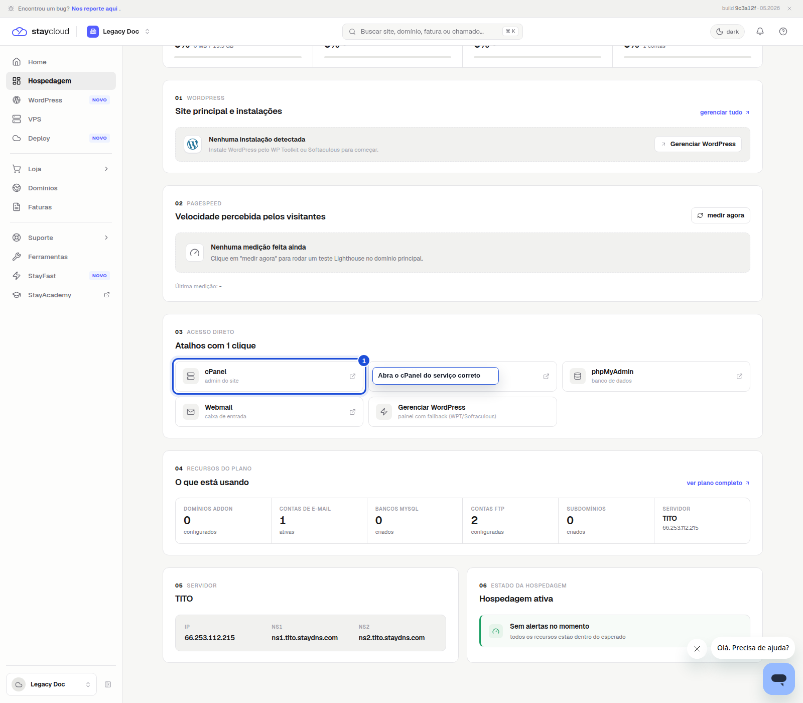
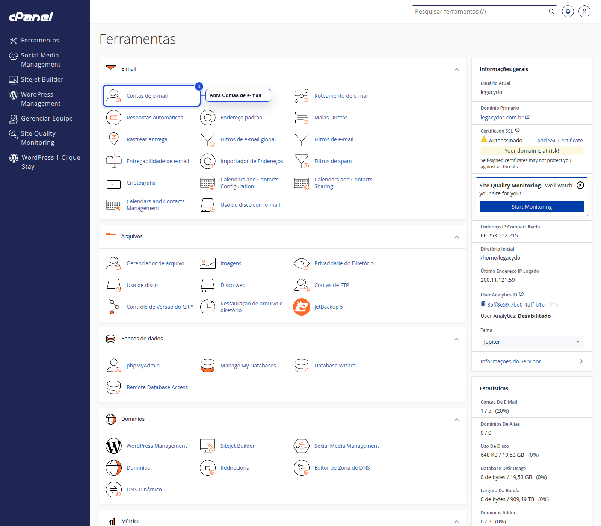
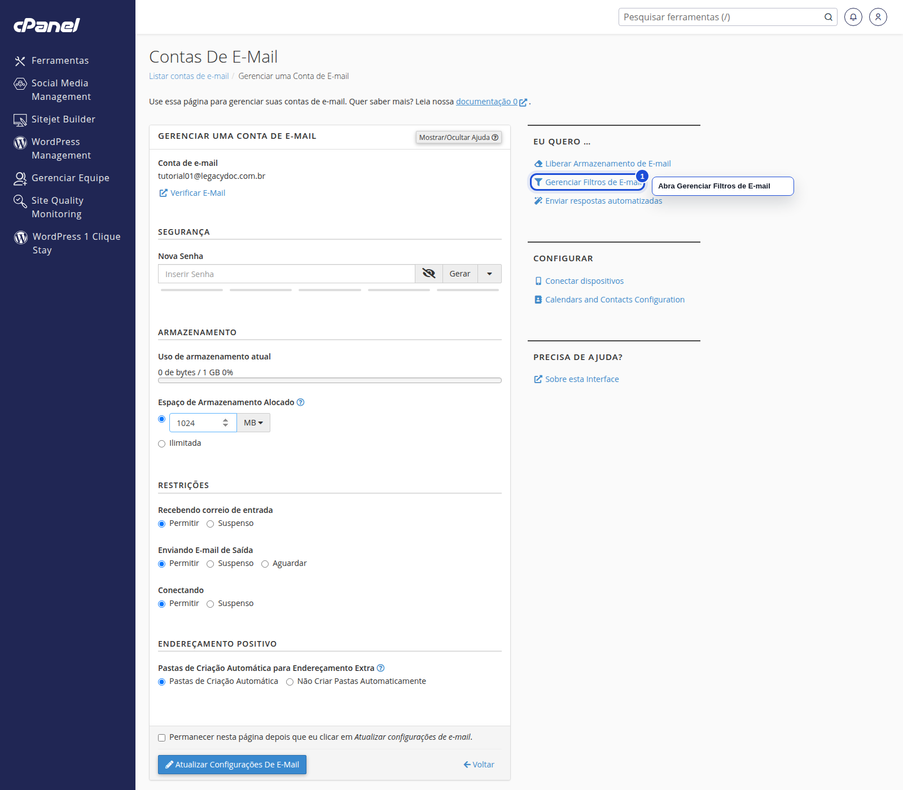
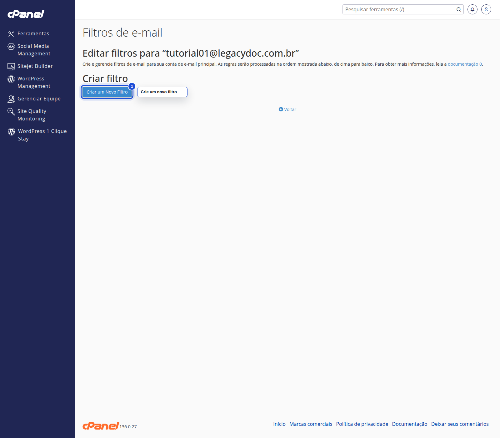
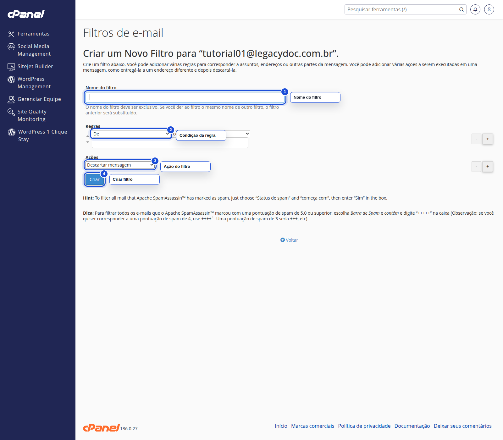

# Como criar filtros de e-mail no Painel Novo da StayCloud

## Status

Rascunho local com prints reais capturados.

## Objetivo

Crie um filtro de e-mail partindo do Painel Novo, passando pelo cPanel e chegando à tela de regras da conta correta.

## Para quem é

- para você que quer organizar mensagens automaticamente
- para você que precisa criar um filtro sem se perder entre as telas
- para você que deseja seguir um fluxo prático e fácil de revisar

## Quando usar

Use este tutorial quando quiser criar um filtro para uma conta específica de e-mail vinculada à sua hospedagem.

## Antes de começar

- tenha acesso ao Painel Novo da StayCloud
- confirme a conta de e-mail que vai receber a regra
- se quiser testar, use um exemplo simples e reversível
- não salve uma regra real sem confirmar o efeito esperado

## Palavra-chave

criar filtros de e-mail no cPanel

## SEO

- **Título SEO:** Como criar filtros de e-mail no Painel Novo da StayCloud
- **Slug:** como-criar-filtros-de-e-mail-no-painel-novo-da-staycloud
- **Meta description:** Veja como criar filtros de e-mail no Painel Novo da StayCloud, passar pelo cPanel e montar uma regra simples com segurança.

## Passo a passo

### 1. Abra a hospedagem correta no Painel Novo

Entre no Painel Novo e selecione a hospedagem em que está a conta de e-mail que você quer filtrar.

O filtro só faz sentido quando a hospedagem certa está aberta.

### 2. Abra Contas de e-mail no cPanel

No cPanel, entre em Contas de e-mail para localizar a conta correta antes de criar a regra.

A lista de contas ajuda você a chegar no endereço certo.

### 3. Abra a conta e entre em Gerenciar Filtros de E-mail

Na conta desejada, clique em Gerenciar e depois em Gerenciar Filtros de E-mail.

Esse é o atalho que leva você para as regras da conta.

### 4. Abra a lista de filtros e crie uma nova regra

Na tela de filtros, clique em Criar um Novo Filtro para seguir com a regra.

A lista mostra o ponto exato para começar uma nova regra.

### 5. Monte a regra e revise antes de salvar

No formulário do filtro, defina um nome, escolha a condição, selecione a ação e revise tudo antes de criar o filtro.

Revise o exemplo antes de salvar qualquer regra real.

## Onde entram os prints

- Print 01: O filtro só faz sentido quando a hospedagem certa está aberta.
- Print 02: A lista de contas ajuda você a chegar no endereço certo.
- Print 03: Esse é o atalho que leva você para as regras da conta.
- Print 04: A lista mostra o ponto exato para começar uma nova regra.
- Print 05: Revise o exemplo antes de salvar qualquer regra real.

## Legenda e instrução dos prints

- Print 01: Painel Novo da StayCloud com o serviço correto em destaque antes do acesso ao cPanel
- Print 02: cPanel com a área Contas de e-mail destacada no painel de ferramentas
- Print 03: Tela de gerenciamento da conta de e-mail com o link Gerenciar Filtros de E-mail destacado
- Print 04: Tela de filtros de e-mail com o botão Criar um Novo Filtro destacado
- Print 05: Formulário de criação de filtro com nome, condição, ação e botão Criar destacados

## Alerta de dados sensíveis

- não exponha senhas, tokens, cookies ou sessões;
- não mostre dados de outra conta;
- não salve nenhuma credencial no arquivo;
- se aparecer uma informação sensível, mascare ou refaça a captura.

## Erros comuns

- abrir os filtros da conta errada
- criar uma regra sem entender a ação
- salvar um filtro irreversível sem teste
- pular a etapa de revisar a conta no Painel Novo

## Quando abrir ticket

- se a opção Gerenciar Filtros de E-mail não aparecer
- se o formulário de filtro não carregar
- se alguma ação não estiver disponível
- se você não conseguir testar a regra com segurança

## Conclusão

Quando você entra pela hospedagem certa, encontra a conta certa e revisa a regra antes de salvar, o filtro fica mais fácil de manter.

## Checklist SEO Rank Math

- [x] palavra-chave principal definida
- [x] título SEO definido
- [x] slug definido
- [x] meta description definida
- [x] palavra-chave presente no título
- [x] palavra-chave presente na introdução
- [x] palavra-chave presente no slug
- [x] meta description clara e útil

## Checklist UI/UX

- [x] objetivo claro em poucos segundos
- [x] ordem dos passos lógica
- [x] você sabe onde clicar
- [x] a linguagem está simples
- [x] há orientação quando algo não aparece
- [x] o fluxo reduz fricção

## Checklist visual/prints

- [x] contexto suficiente
- [x] sem dados sensíveis
- [x] foco visual claro
- [x] marcação útil
- [x] sem corte excessivo
- [x] sem zoom excessivo

## Checklist final antes do WordPress

- [x] rascunho local concluído
- [x] SEO definido
- [x] UI/UX validado
- [x] print plan criado
- [x] HTML preview criado
- [x] HTML WordPress criado
- [x] sem publicação
- [x] sem mídia no WordPress

## Validação interna

- **Agente Tutorial StayCloud:** aprovado com ajustes
- **Agente SEO Rank Math:** aprovado
- **Agente Visual e Prints:** aprovado
- **Agente UI/UX Experience:** aprovado
- **Agente Redator:** aprovado
- **Agente Segurança:** aprovado
- **Agente Auditor:** aprovado com ajustes
- **Quality Gate:** aprovado com ajustes

## Observações

O fluxo foi testado até o formulário; a gravação da regra deve ser validada apenas em cenário seguro.
