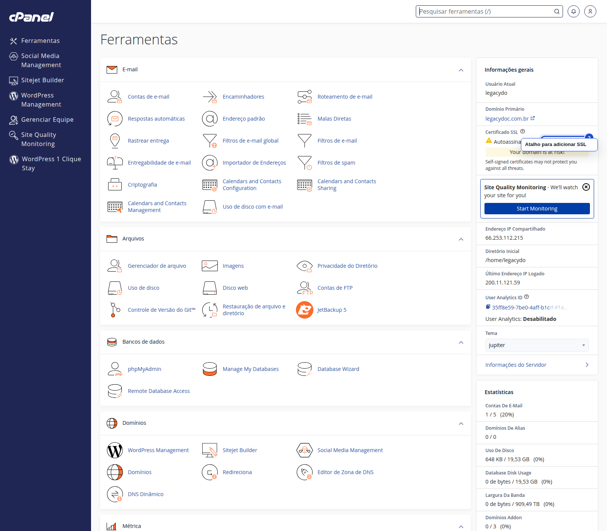
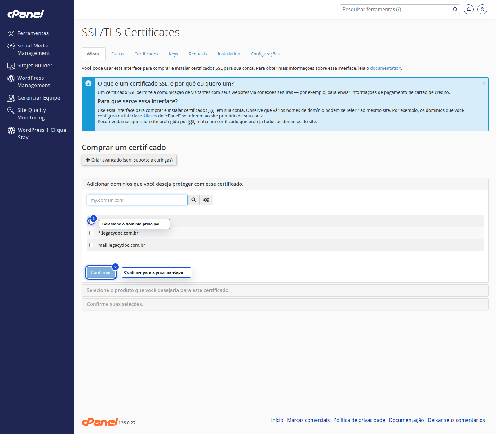

# Como gerar certificados SSL gratuitos no Painel Novo da StayCloud

## Status

Rascunho local com prints reais capturados.

## Objetivo

Abra o caminho certo pelo Painel Novo, chegue à interface do SSL no cPanel e identifique o ponto seguro para avançar com um certificado gratuito.

## Para quem é

- para você que precisa proteger seu site com SSL
- para você que quer começar pelo Painel Novo antes de entrar no cPanel
- para você que precisa entender onde clicar sem confundir o domínio

## Quando usar

Use este tutorial quando quiser iniciar a emissão de um SSL gratuito para o domínio correto da sua hospedagem.

## Antes de começar

- tenha acesso ao Painel Novo da StayCloud
- confirme o domínio que você quer proteger
- verifique se o DNS do domínio aponta para a hospedagem correta
- se a tela final pedir confirmação, valide em ambiente seguro antes de concluir

## Palavra-chave

gerar certificados SSL gratuitos na StayCloud

## SEO

- **Título SEO:** Como gerar certificados SSL gratuitos no Painel Novo da StayCloud
- **Slug:** como-gerar-certificados-ssl-gratuitos-no-painel-novo-da-staycloud
- **Meta description:** Veja como iniciar a geração de certificados SSL gratuitos no Painel Novo da StayCloud, escolher o domínio correto e identificar o ponto seguro do processo.

## Passo a passo

### 1. Abra a hospedagem correta no Painel Novo

Entre no Painel Novo e selecione a hospedagem que contém o domínio que você deseja proteger.

Sempre confirme a hospedagem antes de procurar a área de SSL.

### 2. Acesse a área de SSL no cPanel

No cPanel, abra a interface de SSL/TLS Certificates para iniciar o processo.

A porta de entrada do processo fica na área de SSL do cPanel.

### 3. Selecione o domínio e avance com cuidado

Na tela do SSL, marque o domínio principal e confira a próxima etapa antes de seguir.

Esse é o ponto ideal para conferir se o domínio está correto.

## Onde entram os prints

- Print 01: Sempre confirme a hospedagem antes de procurar a área de SSL.
- Print 02: A porta de entrada do processo fica na área de SSL do cPanel.
- Print 03: Esse é o ponto ideal para conferir se o domínio está correto.

## Legenda e instrução dos prints

- Print 01: Painel Novo da StayCloud com o serviço correto selecionado e acesso ao cPanel visível
- Print 02: cPanel com a área SSL/TLS Certificates destacada no menu de segurança
- Print 03: Tela do assistente de SSL com o domínio principal e o botão Continuar destacados

## Alerta de dados sensíveis

- não exponha senhas, tokens, cookies ou sessões;
- não mostre dados de outra conta;
- não salve nenhuma credencial no arquivo;
- se aparecer uma informação sensível, mascare ou refaça a captura.

## Erros comuns

- escolher o domínio errado
- avançar sem confirmar o DNS
- tratar a etapa final de emissão como validada sem teste seguro
- confundir a interface de compra com a emissão gratuita

## Quando abrir ticket

- se o domínio não aparecer na lista
- se a interface de SSL não carregar
- se a opção gratuita não estiver disponível
- se a confirmação final exigir uma validação que você não consiga reproduzir com segurança

## Conclusão

Quando você começa pelo Painel Novo, confere o domínio certo e chega até a etapa segura do assistente, o fluxo de SSL fica claro para revisão.

## Checklist SEO Rank Math

- [x] palavra-chave principal definida
- [x] título SEO definido
- [x] slug definido
- [x] meta description definida
- [x] palavra-chave presente no título
- [x] palavra-chave presente na introdução
- [x] palavra-chave presente no slug
- [x] meta description clara e útil

## Checklist UI/UX

- [x] objetivo claro em poucos segundos
- [x] ordem dos passos lógica
- [x] você sabe onde clicar
- [x] a linguagem está simples
- [x] há orientação quando algo não aparece
- [x] o fluxo reduz fricção

## Checklist visual/prints

- [x] contexto suficiente
- [x] sem dados sensíveis
- [x] foco visual claro
- [x] marcação útil
- [x] sem corte excessivo
- [x] sem zoom excessivo

## Checklist final antes do WordPress

- [x] rascunho local concluído
- [x] SEO definido
- [x] UI/UX validado
- [x] print plan criado
- [x] HTML preview criado
- [x] HTML WordPress criado
- [x] sem publicação
- [x] sem mídia no WordPress

## Validação interna

- **Agente Tutorial StayCloud:** aprovado com ajustes
- **Agente SEO Rank Math:** aprovado
- **Agente Visual e Prints:** aprovado com ajustes
- **Agente UI/UX Experience:** aprovado
- **Agente Redator:** aprovado
- **Agente Segurança:** aprovado
- **Agente Auditor:** aprovado com ajustes
- **Quality Gate:** aprovado com ajustes

## Observações

A jornada principal está capturada; a confirmação final da emissão gratuita deve ser validada antes da publicação.
